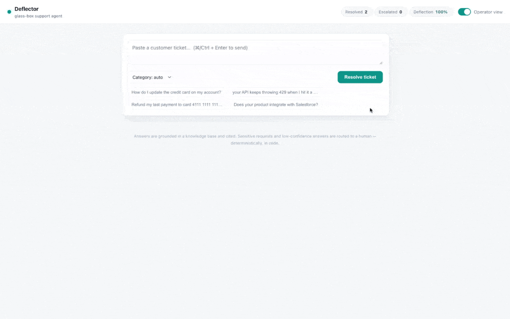
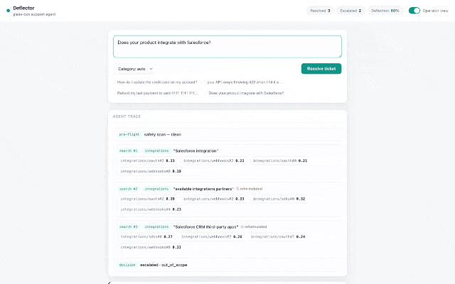

# Enterprise Customer-Support Deflector

A lightweight RAG micro-service that resolves customer tickets from a small knowledge
base, cites its sources, tags confidence, and escalates anything it shouldn't answer.

**Design in one line:** a *constrained agent inside a deterministic safety envelope* —
the model handles judgment (how to search, can I answer?), code handles guarantees
(sensitive data always escalates, confidence is always recomputed).

- **Generation:** Claude (default `claude-haiku-4-5`, configurable)
- **Embeddings:** OpenAI `text-embedding-3-small`
- **Vector store:** Pinecone (serverless)
- **API:** FastAPI — `POST /query`, `GET /health`

---

## Demo

The console streams the agent's reasoning live: safety pre-flight → knowledge-base
searches (with scores and reformulations) → decision → a confidence-scored, cited answer,
or a routed-to-human escalation.

**Resolving a ticket — grounded, cited, High confidence:**



**Agentic re-search → honest escalation:** when the knowledge base doesn't cover the
question, the agent reformulates its search several times, then escalates out-of-scope
instead of guessing.



---

## Architecture

```
ticket -> FastAPI /query
             |
             v
     [PRE-FLIGHT]  PII / sensitivity scan (deterministic)
             |  clean                  \- hit -> escalate(sensitive_data)
             v
     [AGENT CORE]  Claude tool loop  <-- search_knowledge_base --> Pinecone
             |      terminal: submit_answer | escalate
             v
     [POST-FLIGHT] validate citations - compute confidence in code - enforce escalate-on-Low
             |
             v
     response { answer, citations, confidence, escalate, escalation_reason }
```

**Why an agent, not one-shot RAG:** real tickets are messy ("your API keeps dying").
The agent can reformulate its query and search again when the first retrieval is weak —
one-shot RAG can't recover from a bad first embedding.

**Why the envelope is deterministic:** PII detection and final confidence are computed in
code, never delegated to the model. The model can't "forget" to check for a credit-card
number, and it can't self-declare "High confidence" to dodge escalation.

### The agent's tools (3)
| Tool | Terminal | Purpose |
|---|---|---|
| `search_knowledge_base(query, category?)` | no | retrieve top-k chunks; may be called repeatedly |
| `submit_answer(answer, cited_chunk_ids, is_fully_grounded)` | yes | typed final answer |
| `escalate(reason, summary)` | yes | route to a human |

### Confidence (computed in `guardrail.py`, post-flight)
- **High** — grounded AND top cited score >= `CONF_HIGH` (0.50)
- **Medium** — grounded AND `CONF_MEDIUM` (0.35) <= score < `CONF_HIGH`
- **Low** — ungrounded OR score < `CONF_MEDIUM` OR citations don't resolve
- `escalate = (confidence == Low) OR sensitivity hit`

---

## Setup

```bash
python -m venv .venv && source .venv/bin/activate
pip install -r requirements.txt

cp .env.example .env      # fill in ANTHROPIC_API_KEY, OPENAI_API_KEY, PINECONE_API_KEY

python -m scripts.ingest  # chunk docs/ -> embed -> create + populate Pinecone index
uvicorn app.main:app --reload
```

**Glass-box console:** open **http://localhost:8000** — a live UI that streams the agent's
reasoning as it works: the safety pre-flight, each knowledge-base search (with scores and
reformulations), the decision, a confidence meter, clickable citations, and the escalation
reason. Toggle **Operator view** off for the clean customer-facing answer; a deflection
stats strip tracks resolved vs escalated. Streaming is Server-Sent Events over
`GET /query/stream`.

Query the JSON API directly:
```bash
curl -s localhost:8000/query -H 'content-type: application/json' \
  -d '{"question":"How do I update my credit card?"}' | jq
```

Endpoints: `GET /` (console) · `POST /query` (JSON) · `GET /query/stream` (SSE) ·
`GET /stats` · `GET /health`.

Run the smoke eval (5 tickets: High / Medium / Low / sensitive / out-of-scope):
```bash
python eval.py
```

---

## Prompt-engineering strategy

- **Grounding by construction.** The system prompt forbids outside knowledge — the model
  may answer *only* from `search_knowledge_base` results, and must return the `chunk_id`s
  it used. Ungrounded answers can't pass as High confidence because post-flight recomputes
  confidence from the *cited* chunks' retrieval scores.
- **Terminal tools, not free text.** The model ends the loop by calling `submit_answer`
  or `escalate`. This gives typed, guaranteed-parseable output and a clean stop signal —
  no brittle JSON-in-text parsing.
- **Agentic retrieval.** The prompt tells the model to reformulate and search again when
  results look weak, capped at `MAX_AGENT_ITERS` (4) as a cost/latency backstop.
- **Chunking.** Docs are split by `## ` Q&A heading (`scripts/ingest.py`) — one chunk =
  one Q&A pair — because FAQs are already semantically chunked; fixed-token windows would
  split answers mid-thought.

---

## Cost estimate per 1,000 queries

Assumptions: agentic loop averages ~2 Claude calls/query (~3,000 input + ~300 output
tokens total), ~2 query embeddings/query (~60 tokens). Pinecone serverless reads at this
volume are effectively free-tier.

| Component | Per 1,000 queries |
|---|---|
| Generation — **Haiku 4.5** (default, $1 / $5 per 1M) | ~**$4.50** |
| Generation — Sonnet 5 (intro $2 / $10) | ~$9.00 |
| Generation — Opus 4.8 ($5 / $25) | ~$22.50 |
| OpenAI embeddings (`text-embedding-3-small`, $0.02 / 1M) | ~$0.01 |
| Pinecone serverless reads | ~$0 (free tier at this volume) |
| **Total (Haiku default)** | **~$4.50 / 1k** |

The agentic loop costs more than one-shot RAG (2–3 LLM calls vs 1) — that's the price of
recovering messy tickets. Switch `GEN_MODEL` in `.env` to trade cost for quality.

---

## Design choices & trade-offs
- **Pinecone for a small corpus** — lean at build time and it's the production path: no
  migration when the KB grows from 8 docs to 8,000. `rag.search_knowledge_base` is the
  swap seam if a simpler store is ever wanted.
- **Hand-written agent loop** (`app/agent.py`) over a framework — legible top-to-bottom
  and no hidden control flow; a production system would add tracing + a durable queue.
- **In-scope for a take-home; deliberately omitted:** auth, persistence, per-tenant
  isolation, streaming, a deflection-rate metrics pipeline (every tool call is a natural
  log point to add it).

## Knowledge base
`docs/` holds ~15 FAQ documents across 6 categories (each subfolder = one category, used
as the retrieval filter):
```
docs/
  billing/          payments · invoices · plans_and_seats · refunds_and_credits
  api/              rate_limits · errors · usage_and_quotas · versioning
  integrations/     webhooks · oauth · sdks
  authentication/   api_keys · sso
  account/          workspaces_and_roles
  data/             export_and_retention
```

## Layout
```
app/       main.py - config.py - schemas.py - rag.py - guardrail.py - agent.py
scripts/   ingest.py        # walks docs/<category>/*.md, chunks by Q&A, upserts
docs/      <category>/*.md  # ~15 documents, 6 categories
eval.py    5-case smoke test
```
